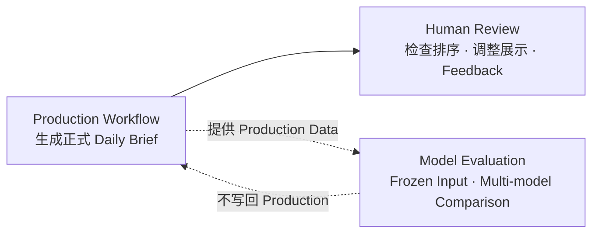
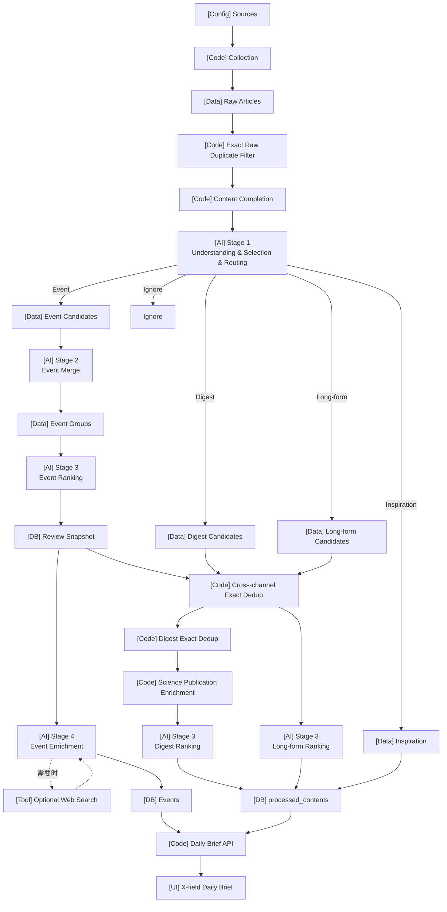
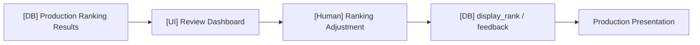
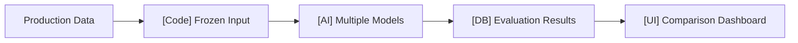
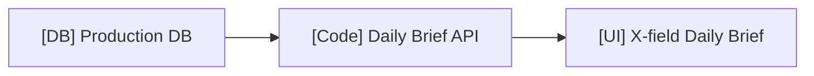

# X-AI-field Workflow Overview

本文档只描述 X-AI-field 当前系统的**高层工作流和主要模块关系**。

具体规则分别由对应 Source of Truth 定义：

- AI 判断语义 → `03-ai-workflow-spec.md`
- Production Pipeline 执行、scope、retry、persistence、lineage → `06-processing-workflow.md`
- Prompt / Structured Output → `07-prompt-spec.md`
- Commands / Tests / Diagnostics → `09-operations.md`

---

## 1. System Overview

X-AI-field 当前包含三条主要工作流：

- **Production Workflow**：生成正式 Daily Brief 数据。
- **Human Review**：位于 Production 结果之上，用于人工检查排序、调整最终展示顺序并记录反馈。
- **Model Evaluation**：独立旁路，在相同 Frozen Input 下比较不同模型，不修改 Production 数据。

---

## 2. Production Workflow

节点前缀表示主要职责：

- `[Config]`：配置
- `[Code]`：确定性代码处理
- `[Data]`：Pipeline 中间数据
- `[AI]`：LLM 判断或生成
- `[DB]`：持久化边界
- `[Tool]`：按需调用的外部工具
- `[UI]`：用户界面

这张图只表达主要数据流。具体 dedup、enrichment、Review Snapshot、ranking persistence、retry 和 lineage 等执行规则见 `06-processing-workflow.md`。

---

## 3. 四个 AI Stages

| Stage | High-level responsibility |
|---|---|
| Stage 1 | 单篇内容：理解、筛选、Routing |
| Stage 2 | Event Candidates：判断哪些报道属于同一现实事件 |
| Stage 3 | 各 Channel：判断相对重要性 / 阅读价值 |
| Stage 4 | Selected Events：生成最终事件内容，必要时 Web Search 补充外部上下文 |

AI 判断规则见 `03-ai-workflow-spec.md`；Prompt、Structured Output 和模型 Contract 见 `07-prompt-spec.md`。

---

## 4. Human Review Workflow

Human Review 不重新执行完整 Production Pipeline。它用于检查 AI Ranking、调整最终展示顺序并留下反馈；当人工调整导致最终展示需要尚未生成的 Event 内容时，可以复用 Production 的 Event Enrichment 能力。

具体执行和 persistence 规则见对应 Processing / Data Model Spec。

---

## 5. Model Evaluation Workflow

Model Evaluation 用于在**相同输入**下比较不同模型的结果。它独立于 Production Daily Workflow：

- 不由 Daily Workflow 自动触发；
- 不修改正式 Event、Content、Ranking 或 Feedback；
- Evaluation 结果只用于 Observation / Comparison；
- 当前 MVP 不评估 Stage 4。

具体运行命令见 `09-operations.md`。

---

## 6. Daily Brief Output

Production 最终形成：

| Section | Production data |
|---|---|
| Today's Events | `events` |
| Source Digests | `processed_contents`(routing=digest + rank) |
| Long-form Reads | `processed_contents`(routing=long_form + rank) |
| Daily Inspiration | `processed_contents`(routing=inspiration) |

最终展示链路：

具体表结构和字段定义见 `05-data-model.md`。
