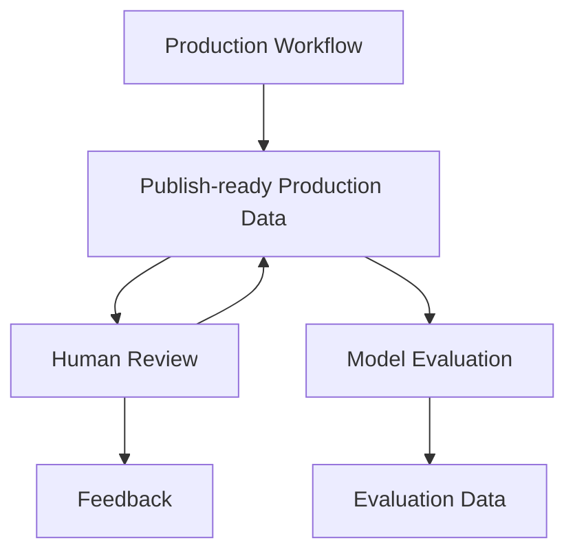
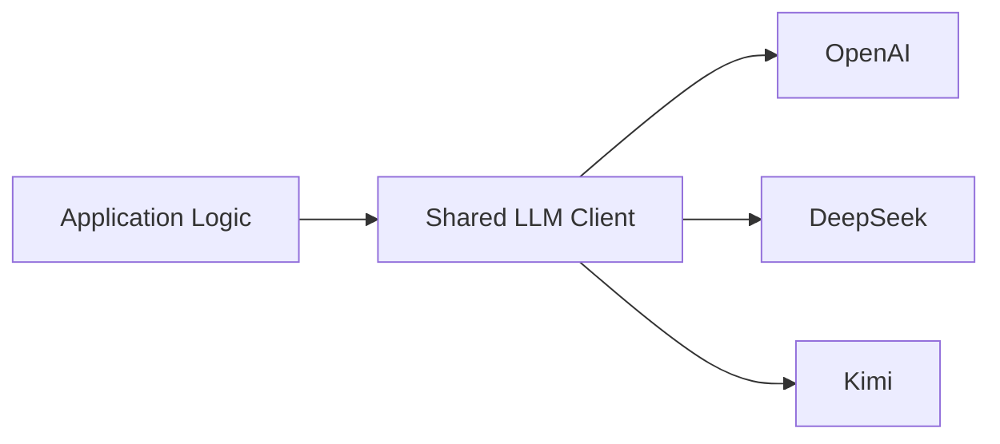
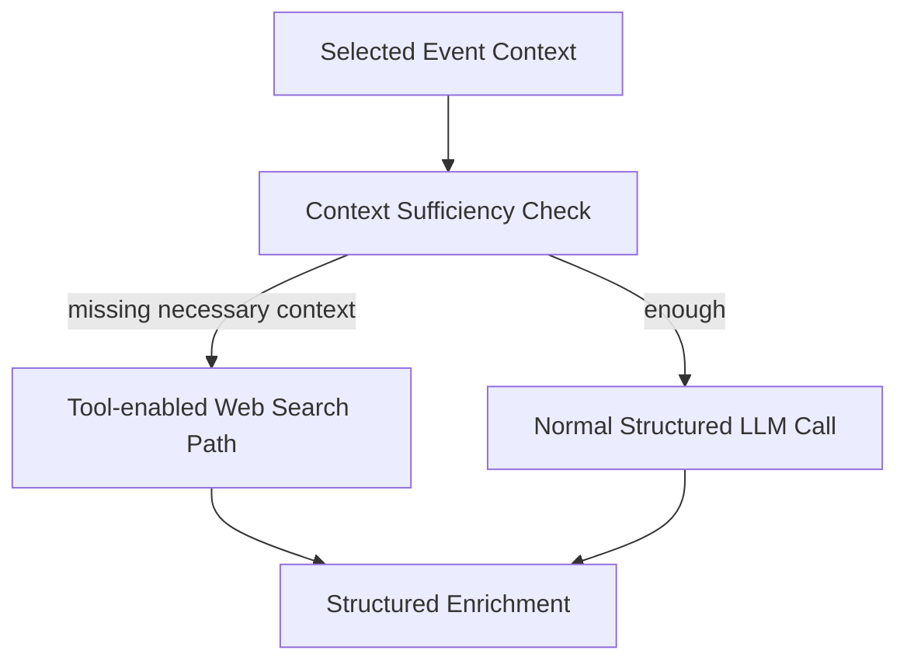

# X-AI-field Technical Spec

本文档定义 X-AI-field 当前的技术架构、系统边界、模块职责与稳定工程约束。

---

## 1. System Architecture

MVP 采用简单的三层架构：

```text
Data Layer → Processing Layer → Presentation Layer
```

MVP 保持单一 Next.js + PostgreSQL 应用，不引入微服务、Queue、Workflow Engine 或复杂 Agent Framework。

### 1.1 Data Layer

核心数据关系：

```text
sources
  ↓
raw_articles
  ↓
processed_contents
    ├── Event Candidate ──→ events
    ├── Source Digest
    ├── Long-form
    └── Inspiration

Stage 3 Event Ranking → event_review_items

feedback

evaluation_inputs → evaluation_runs → evaluation_outputs
```

- `sources`：Source List 与采集配置
- `raw_articles`：Collector 标准化后的原始内容
- `processed_contents`：Stage 1 处理后的内容，Ignore 不入库
- `events`：最终生成并用于展示的 Event
- `event_review_items`：Event Ranking Human Review 的历史快照
- `feedback`：人工 Review 产生的反馈数据
- `evaluation_*`：Model Evaluation 使用的冻结输入、模型运行与输出，与正式 Production 结果隔离

具体表结构、字段、约束、关系与索引以 `05-data-model.md` 为准。

### 1.2 Processing Layer

Production Processing 主流程：

```text
Source Collection
→ Pre-Stage1 Exact Dedup
 → Content Completion
  → Stage 1 → Stage 2 → Stage 3 → Stage 4
```

#### Source Collection

主要由代码完成，负责：
- 获取新增内容；
- 保存 Source Metadata（包括 Category）；
- 尽可能保存原始正文与原始 Metadata；
- URL / GUID 等基础去重；
- 写入 `raw_articles`。

#### Pre-Stage1 Exact Dedup

由代码完成，在进入后续 Processing 前去除可确定为完全重复的内容（`raw_articles.stage1_status = ignored`），避免重复内容继续消耗 Content Completion 与 LLM Processing。

#### Content Completion

主要由代码完成，在进入 AI Processing 前尽可能补全缺失正文，为后续 Stage 提供更完整的输入。

#### Stage 1 — Content Understanding & Selection

LLM 完成，负责：Understanding、Selection、Routing、Tagging、Entity、Summary、Translation。

处理结果进入 `processed_contents`。

#### Stage 2 — Event Merge

LLM 完成，将属于 Event Channel 的候选内容（`processed_contents.routing = event`）按现实事件或紧密关联的 Event Thread 合并为 Event Groups。

Event Groups 是当前 Workflow 的中间结果，不直接写入 events 表；Stage 2 不生成最终 Event 内容，也不执行 Ranking。

#### Stage 3 — Channel Ranking

LLM 完成，对不同 Channel 独立执行 Ranking：Event、Digest、Long-form。

AI 负责相对排序；最终选择与展示数量由 Application Code 决定。排序保留 AI 原始结果与独立的展示排序；Inspiration 不需要 AI Ranking。

#### Stage 4 — Selected Event Enrichment

LLM 完成，处理经过 Stage 3 Ranking 和最终选择后入选的 Event Groups。每个 Selected Event 独立完成最终 Event synthesis / enrichment，生成 publish-ready Event。

Stage 4 可在确实缺少必要外部上下文时使用 Web Search；默认仍走普通 LLM Structured Output 路径。

具体 AI 判断语义以 `03-ai-workflow-spec.md` 为准；Daily Scope、执行顺序、重试、幂等、持久化和 lineage 等执行语义以 `06-processing-workflow.md` 为准。

### 1.3 Presentation Layer

X-AI-field 负责生成和提供 publish-ready 数据，不负责最终用户侧 Daily Brief 页面。

```text
PostgreSQL
   ↓
X-AI-field API
   ↓ HTTP
X-field UI
```

X-AI-field 同时包含 Internal Dashboard，用于运行观察、Daily Job Report、Human Review 与 Model Evaluation。

---

## 2. Tech Stack

- Runtime：Next.js + TypeScript
- Database：PostgreSQL / Supabase
- ORM：Drizzle ORM
- AI Integration：共享 LLM compatibility layer
- Supported Providers：OpenAI / DeepSeek / Kimi
- Structured Output：Provider 输出 + Application Schema Validation
- External Retrieval：可选 `web_search` in Stage 4
- Scheduling：Cron / Scheduled Job
- Runtime Artifacts：本地文件系统，Git ignored

---

## 3. Data Model

PostgreSQL 是 Production System of Record。

Production 数据主要包括：

```text
Production Content Data
Review / Feedback Data
Model Evaluation Data
```

数据库负责持久化业务状态；`runtime/` 只保存运行级 artifacts，不替代数据库。

详细表结构、字段、关系、约束和索引定义见 `05-data-model.md`。

---

## 4. Processing Workflow

Production Workflow、Human Review 与 Model Evaluation 是三个职责不同的流程：



### 4.1 Production Workflow

负责从 Source Collection 到 Stage 4 生成 publish-ready Production Data。

Production Workflow 必须支持安全重复执行（Idempotency），避免 Retry / Re-run 产生重复或不一致的 Production State。

具体 Processing 流程已在 §1.2 概述；Daily Scope、Idempotency、Retry、Persistence 与 Lineage 等完整执行语义见 `06-processing-workflow.md`。

### 4.2 Human Review

Human Review 作用于已经生成的 Production 结果：
- Review Event / Long-form Ranking；
- 调整展示顺序；
- 保存人工 Feedback；
- 不覆盖 AI 原始判断。

Human Review 可以调用已有 Processing 能力，但不建立第二套 Production Pipeline。

### 4.3 Model Evaluation

Model Evaluation 是独立的观察与比较流程：
- Evaluation 数据独立保存；
- 不自动回写 Production 内容；
- 不改变 Daily lineage；
- 不替代正式 Production Processing。

---

## 5. LLM Integration

LLM Integration 通过共享 compatibility layer 与业务逻辑解耦：



LLM 的 Runtime Prompt 位于 `src/prompts/`，Prompt 与 Structured Output Contract 见 `07-prompt-spec.md`


### 5.1 Structured Output 边界

```text
Application Input
→ LLM Request
→ Structured Output
→ Application Schema Validation
→ Business Logic / Persistence
```

不同 Provider 的原生 Structured Output 能力可以不同，但输出在被业务逻辑使用或持久化之前，都必须通过相同的 Application-side Contract Validation。

### 5.2 Provider Independence

系统通过共享 LLM Client 支持不同 Provider，使模型或 Provider 可以替换，而不要求修改对应 Workflow 的业务逻辑。具体 Provider 配置与环境变量属于运行配置，不在本节重复定义。

### 5.3 可选 External Retrieval

Stage 4 存在两条技术执行路径：



External Retrieval 是可选能力，不是每个 Event 的默认路径。何时需要外部上下文由 `03-ai-workflow-spec.md` 定义。

---

## 6. API 与展示边界

X-AI-field 不负责最终用户侧 Daily Brief UI。Daily Brief 页面位于独立的 X-field 项目中：

```text
PostgreSQL
   ↓
X-AI-field Application API
   ↓ HTTP
X-field UI
```

X-AI-field 当前提供的 Application API 主要服务于 Daily Brief、Read More、Human Review 和 Model Evaluation。

具体 Endpoint 的 Request / Response Contract 由对应实现与代码注释维护，不在 Technical Spec 中重复维护。

### 6.1 Daily Brief API
```text
GET /api/brief?date=YYYY-MM-DD
```
Daily Brief API 按指定日期提供 publish-ready 内容。它读取 Production 数据，不额外创建 `daily_briefs` snapshot 层，并作为 X-AI-field 与 X-field 之间的 Presentation Boundary。

Daily membership、Ranking 与 Composition 的执行语义见 `06-processing-workflow.md`。

### 6.2 Read More
```text
POST /api/content/read-more
{ "contentId": "processed_contents.id" }
```
Read More 是 Presentation Layer 按需触发的 AI 能力：

```text
User Request → Read More API → Server-side Full Content → LLM → Detailed Reading Guide
```

原始 Full Content 保持在 Server-side，不返回给 Client。Read More 的 AI 语义见 `03-ai-workflow-spec.md`；Prompt / Structured Output Contract 见 `07-prompt-spec.md`。

---

## 7. Internal Dashboard

X-AI-field 包含一个 Internal Dashboard，用于运行观察、Human Review 与 Model Evaluation。

Dashboard 不是 Production Source of Truth。它读取 Production 数据与 Runtime Artifacts，并调用已有 Application Services，不应在 UI 层复制 Processing、Review 或 Evaluation 的业务逻辑。

### 7.1 最近 7 天 Overview

展示最近 7 天 Daily Processing 状态与关键运行指标。

### 7.2 Daily Job Report

查看指定日期的 Daily Job 运行情况与各 Processing Step 的结果，用于判断该次运行是否正常完成以及定位问题。

### 7.3 Human Review

提供人工 Review 界面：
- Review Event Ranking；
- Review Long-form Ranking；
- 调整 Display Order；
- 保存 Ranking Feedback。

### 7.4 Model Evaluation

提供 Model Evaluation 界面，用于比较不同模型在已支持 AI Stage 上的输出结果。

Dashboard 的具体 UI Layout 与交互细节以实现为准，不在 Technical Spec 中维护。

---

## 8. Project Structure & Engineering Rules

### 8.1 Project Structure

项目保持相对平铺的目录结构：

```text
X-AI-field/
├── src/
│   ├── app/            # HTTP Routes / Internal Dashboard UI
│   ├── collectors/
│   ├── db/
│   ├── lib/
│   ├── processing/
│   └── prompts/
├── scripts/
├── drizzle/
├── runtime/
├── docs/               # Project Specs / operational documentation
│   ├── 01-product-spec.md
│   ├── 02-workflow-overview.md
│   ├── 03-ai-workflow-spec.md
│   ├── 04-technical-spec.md
│   ├── 05-data-model.md
│   ├── 06-processing-workflow.md
│   ├── 07-prompt-spec.md
│   ├── 08-source-list.md
│   └── 09-operations.md
├── AGENTS.md
└── README.md
```

Technical Spec 维护目录级职责，不需要镜像每一个具体 Source File。

### 8.2 Module Boundaries

- `collectors`：外部数据采集与标准化。
- `processing`：Production Processing、Review / Evaluation Services 与相关 Persistence Orchestration。
- `prompts`：Runtime LLM Prompts。
- `db`：Database Schema 与 Connection。
- `lib`：共享 Application Logic 与 API Composition Helpers。
- `app`：HTTP Routes 与 Internal UI。
- `runtime`：运行级 Operational / Debug Artifacts。
- `scripts`：CLI Entry Points 与专用 Operational Tools。

核心业务逻辑应放在可复用的 Application / Processing Modules 中，不应重复写入 Route Handler、UI Component 或 CLI Script。

### 8.3 Dependency Direction

优先保持依赖方向：

```text
app / scripts
    ↓
application / processing modules
    ↓
db / llm / external adapters
```

除非逻辑确实只属于对应 Boundary，否则不要把核心业务行为直接放入 UI Component、API Route Glue、CLI Entry Point 或 Runtime Artifact Reader。

### 8.4 Engineering Rules

- KISS
- YAGNI
- 同一事实只在唯一 Source of Truth 中定义
- 模块保持单一、清晰职责。
- 优先显式代码，不做过早抽象。不为假设中的未来规模提前引入基础设施。
- 通用基础能力优先使用成熟 Library。
- 不静默忽略错误。
- Secrets 与环境相关配置不得硬编码。
- Model / Provider 应保持可替换。
- Structured AI Output 必须验证后再使用。

### 8.5 Error Handling

- 错误尽量在最接近发生位置处理并记录；
- 无关工作能够安全继续时，应隔离局部失败；
- 保留足够信息支持针对性 Retry 与 Diagnosis；
- 不通过 Silent Fallback 隐藏异常。

具体 Step Retry / Recovery 语义见 `06-processing-workflow.md`；Operational Recovery Commands 见 `09-operations.md`。

### 8.6 Testing Boundary

测试应保护会造成实质性 Regression 的架构与行为 Contract。具体 Test Commands 与 Test Inventory 见 `09-operations.md`。

---

## 9. Runtime Architecture

`runtime/` 保存 Production Processing 与相关工具生成的 Run-level Artifacts。

主要用途：

- 保存真实 Model Input / Output；
- Debug；
- Operational Inspection；
- Run Metadata；
- Diagnostics；
- 支持对失败运行进行可复现的调查。

### 9.1 Runtime 不是 Production State

Runtime Artifacts：

- Git ignored；
- 不是 Application Database；
- 不是 Durable Business Source of Truth；
- 不应静默成为 Processing Stages 之间的正式数据接口。

如果某个事实会影响持久化业务行为，它应进入 Production Data 或明确的 Application Contract，而不能只存在于 `runtime/`。

### 9.2 Runtime 与 Dashboard

Internal Dashboard 可以读取 Runtime Artifacts，用于 Daily Job Report 与历史运行 Diagnostics。

当 Runtime 数据不存在时，不应根据当前 Production State 反推出虚假的历史 Runtime Metrics。

### 9.3 Runtime 与 Recovery

Runtime Artifacts 可以在明确需要时辅助 Debug 与 Recovery Analysis，但 Recovery Semantics 应由 Processing Workflow 定义，而不是依赖未文档化的文件系统约定。

具体执行语义与 Operational Procedures 见 `06-processing-workflow.md` 和 `09-operations.md`。
