# X-AI-field Workflow Overview

这张图描述当前完整数据流。`[计划]` 表示尚未实现。

```text
                         ┌────────────────────┐
                         │      Sources       │
                         └─────────┬──────────┘
                                   ↓
                         [Code] Collection
                                   ↓
                         [Data] Raw Articles
                                   ↓
                  [Code] Exact Raw Duplicate Filter
                                   ↓
                     [Code] Content Completion
                                   ↓
               [AI] Stage 1 Understanding & Selection
                                   ↓
                              Routing
             ┌────────────┬────────┼───────────┬────────────┐
             ↓            ↓        ↓           ↓            ↓
           Event        Digest   Long-form  Inspiration   Ignore
             ↓            ↓        ↓           ↓
      Event Candidates    │        │           │
             ↓            │        │           │
      [AI] Stage 2        │        │           │
       Event Merge        │        │           │
             ↓            │        │           │
       Event Groups       │        │           │
             ↓            │        │           │
      [AI] Event Rank     │        │           │
             ↓            │        │           │
       [DB] Review Snapshot│       │           │
             ↓            │        │           │
      [AI] Stage 4 Top N  │        │           │
       Enrichment         │        │           │
          ↙   ↘           │        │           │
   sources     optional   │        │           │
              Web Search  │        │           │
             ↓            ↓        ↓           │
        [DB] Events    Dedup     Dedup         │
                          ↓        ↓           │
                     Science       │           │
                     Enrichment    │           │
                          ↓        ↓           │
                   [AI] Digest  [AI] Long-form │
                      Ranking      Ranking     │
                          ↓        ↓           ↓
                    [DB] processed_contents
                              │
                ┌─────────────┴──────────────┐
                │                            │
            [DB] Events            Ranked / Routed Content
                └─────────────┬──────────────┘
                              ↓
                     [Code] Daily Brief API
                              ↓
                         Daily Brief
```



```mermaid
flowchart LR
    S["[配置] Source List"] --> C["[代码] RSS Collection"]
    C --> R["[数据] raw_articles"]
    R --> RD["[代码] Exact Raw Duplicate Filter"]
    RD --> CC["[代码] Content Completion"]
    CC --> S1["[AI] Stage 1<br/>理解 · 筛选 · Routing"]

    S1 -->|Event| EC["[数据] Event Candidates"]
    S1 -->|Digest| D["[数据] Digest Candidates"]
    S1 -->|Long-form| L["[数据] Long-form Candidates"]
    S1 -->|Inspiration| I["[数据] Inspiration"]
    S1 -->|Ignore| X["丢弃"]

    EC --> S2["[AI] Stage 2<br/>事件合并"]
    S2 --> EG["[DB] Event Groups"]
    EG --> ER["[AI] Stage 3<br/>Event Ranking"]
    ER --> ERDB["[DB] Event Top 50<br/>Review Snapshot"]
    ER --> TOP["[DB] Event Review Snapshot"]

    TOP --> XD["[代码] Cross-channel Exact Dedup"]
    D --> XD
    L --> XD

    XD --> DD["[代码] Digest Exact Dedup"]
    DD --> SP["[代码] Science Publication Enrichment"]
    SP --> DR["[AI] Stage 3<br/>Digest Ranking by Category"]

    XD --> LR["[AI] Stage 3<br/>Long-form Ranking"]

    TOP --> S4["[AI] Stage 4<br/>display_rank Top N Enrichment"]
    S4 -. "需要时" .-> WS["[工具] Optional Web Search"]
    WS -.-> S4

    S4 --> EDB["[DB] events"]
    DR --> PDB["[DB] processed_contents + rank"]
    LR --> PDB
    I --> PDB

    EDB --> API["[代码] Daily Brief API"]
    PDB --> API
    API --> UI["[计划] X-field Daily Brief UI"]

    CRON["[计划] 08:30 Cron"] --> ORCH["[代码] Daily Workflow Orchestrator"]
    ORCH -. "触发" .-> C

    ERDB --> FB["[后台] Event Ranking Review"]
    PDB --> LFR["[后台] Long-form Ranking Review"]
    FB --> FDB["[DB] display_rank + feedback"]
    LFR --> FDB
```

Daily Orchestrator 在启动时按 Asia/Shanghai 08:30 boundary 固定一次 24 小时 Daily scope。
Content Completion 与 Stage 1 以该 `daily_end` 倒推 72 小时的 `published_at` catch-up window
处理延迟进入 RSS 的文章；新 Selected 内容写入本次 workflow 的 `processed_contents.daily_date`。
Stage 2 Event 与 Stage 3 Digest / Long-form 都按该 Daily attribution 全量读取、且仍为 `selected` 的
内容；Stage 3 Event 从 DB Event Groups 读取，Stage 4 从 DB Review snapshot 读取。编排器仍传递 runtime
路径供 observability，但 runtime 不再是下游业务输入的必要条件。

`GET /api/brief?date=YYYY-MM-DD` 的 Event 通过 `stage4_runs.daily_date` 归属，只读取
`publication_status='published'` 的 Events。`events.event_date` 是成员文章时间推导的事件属性，
不决定简报归属；其它内容仍通过 `processed_contents.daily_date` 归属。

## 四个 AI Stage

```text
Stage 1  单篇内容：理解、筛选、Routing
Stage 2  Event Candidates：判断哪些报道属于同一现实事件
Stage 3  各 Channel：决定相对重要性 / 阅读价值
Stage 4  Top Events：生成最终事件内容，必要时补充 Web Search
```

Stage 3 Event Ranking 每次成功后将完整 Top 50（不足时保存全部）写成新的 UUID Review snapshot。Stage 4 按 `display_rank` 选择前 N（默认 15）生成 draft，全部成功后原子发布；Long-form 正式 cutoff 为 Top 10。
Human Review 位于初始 Stage 4 后：保存 Event 排名会同步 `event_review_items.display_rank` 与
`events.display_rank`。新的最终 Top 15 若缺少最终 Event，则仅对该 Event 按需执行 Stage 4；
已有 enrichment 直接复用。LLM 失败时不提交本次排序，用户主动移动仍按原规则记录 feedback。

## Manual Model Evaluation（旁路）

Model Evaluation 不在上图的 Production Daily Pipeline 中，也不会由 Cron / Daily 自动触发。
人工 CLI 对指定 Daily 的单一 Stage 构造一次 Frozen Input，保存后分别调用 DeepSeek、Kimi 等
Evaluation Model：

```text
Production DB / successful Stage 3 runtime
  ↓ (construct once)
evaluation_inputs (same input_hash / input ID)
  ↓
evaluation_runs (one per model) → evaluation_outputs (validated JSON)
```

Stage 1 使用相同 Raw Articles，Stage 2 使用指定日期正式 Stage 1 的 Event Candidates，Stage 3
Event / Digest / Long-form 分别读取同一次正式 Stage 3 run 的对应输入。Evaluation 只写独立表，
不会修改正式内容、Event、Review、Feedback 或 Rank；Stage 4 不参与该 MVP。

Dashboard 手动触发时先持久化同一比较 identity 下的 `evaluation_runs.status = running`，再通过
detached Evaluation CLI 执行。

`review/models` 提供相同旁路的人工入口。页面加载只读取已有 Evaluation；只有点击 Run Evaluation
才会调用 Evaluation Service。页面始终将同一 `evaluation_input_id` 下的最新模型 Runs 进行比较，
因此不会把不同时间冻结的输入拼接成一次模型差异。它是 Observation / Comparison Tool，不会把结果
应用回 Production。

## 数据最终去向

```text
Today's Events     → events
Source Digests     → processed_contents (routing=digest + rank)
Long-form Reads    → processed_contents (routing=long_form + rank)
Daily Inspiration  → processed_contents (routing=inspiration)

上述数据
   ↓
GET /api/brief?date=YYYY-MM-DD
   ↓
X-field 页面
```
