# X-AI-field Workflow Overview

这张图描述当前完整数据流。`[计划]` 表示尚未实现。

```text
                         ┌────────────────────┐
                         │      Sources       │
                         └─────────┬──────────┘
                                   ↓
                         [Code] Collection
                                   ↓
                         [Data] Raw Articles
                                   ↓
                     [Code] Content Completion
                                   ↓
               [AI] Stage 1 Understanding & Selection
                                   ↓
                              Routing
             ┌────────────┬────────┼───────────┬────────────┐
             ↓            ↓        ↓           ↓            ↓
           Event        Digest   Long-form  Inspiration   Ignore
             ↓            ↓        ↓           ↓
      Event Candidates    │        │           │
             ↓            │        │           │
      [AI] Stage 2        │        │           │
       Event Merge        │        │           │
             ↓            │        │           │
       Event Groups       │        │           │
             ↓            │        │           │
      [AI] Event Rank     │        │           │
             ↓            │        │           │
       [Code] Top 10      │        │           │
             ↓            │        │           │
      [AI] Stage 4        │        │           │
       Enrichment         │        │           │
          ↙   ↘           │        │           │
   sources     optional   │        │           │
              Web Search  │        │           │
             ↓            ↓        ↓           │
        [DB] Events    Dedup     Dedup         │
                          ↓        ↓           │
                     Science       │           │
                     Enrichment    │           │
                          ↓        ↓           │
                   [AI] Digest  [AI] Long-form │
                      Ranking      Ranking     │
                          ↓        ↓           ↓
                    [DB] processed_contents
                              │
                ┌─────────────┴──────────────┐
                │                            │
            [DB] Events            Ranked / Routed Content
                └─────────────┬──────────────┘
                              ↓
                     [Code] Daily Brief API
                              ↓
                         Daily Brief
```



```mermaid
flowchart LR
    S["[配置] Source List"] --> C["[代码] RSS Collection"]
    C --> R["[数据] raw_articles"]
    R --> CC["[代码] Content Completion"]
    CC --> S1["[AI] Stage 1<br/>理解 · 筛选 · Routing"]

    S1 -->|Event| EC["[数据] Event Candidates"]
    S1 -->|Digest| D["[数据] Digest Candidates"]
    S1 -->|Long-form| L["[数据] Long-form Candidates"]
    S1 -->|Inspiration| I["[数据] Inspiration"]
    S1 -->|Ignore| X["丢弃"]

    EC --> S2["[AI] Stage 2<br/>事件合并"]
    S2 --> EG["[运行时] Event Groups"]
    EG --> ER["[AI] Stage 3<br/>Event Ranking"]
    ER --> TOP["[代码] Top N Events"]

    TOP --> XD["[代码] Cross-channel Exact Dedup"]
    D --> XD
    L --> XD

    XD --> DD["[代码] Digest Exact Dedup"]
    DD --> SP["[代码] Science Publication Enrichment"]
    SP --> DR["[AI] Stage 3<br/>Digest Ranking by Category"]

    XD --> LR["[AI] Stage 3<br/>Long-form Ranking"]

    TOP --> S4["[AI] Stage 4<br/>Selected Event Enrichment"]
    S4 -. "需要时" .-> WS["[工具] Optional Web Search"]
    WS -.-> S4

    S4 --> EDB["[DB] events"]
    DR --> PDB["[DB] processed_contents + rank"]
    LR --> PDB
    I --> PDB

    EDB --> API["[代码] Daily Brief API"]
    PDB --> API
    API --> UI["[计划] X-field Daily Brief UI"]

    CRON["[计划] 09:00 Cron"] --> ORCH["[代码] Daily Workflow Orchestrator"]
    ORCH -. "触发" .-> C

    UI -. "未来" .-> FB["[计划] Human Review / Feedback"]
```

## 四个 AI Stage

```text
Stage 1  单篇内容：理解、筛选、Routing
Stage 2  Event Candidates：判断哪些报道属于同一现实事件
Stage 3  各 Channel：决定相对重要性 / 阅读价值
Stage 4  Top Events：生成最终事件内容，必要时补充 Web Search
```

## 数据最终去向

```text
Today's Events     → events
Source Digests     → processed_contents (routing=digest + rank)
Long-form Reads    → processed_contents (routing=long_form + rank)
Daily Inspiration  → processed_contents (routing=inspiration)

上述数据
   ↓
GET /api/brief?date=YYYY-MM-DD
   ↓
X-field 页面
```